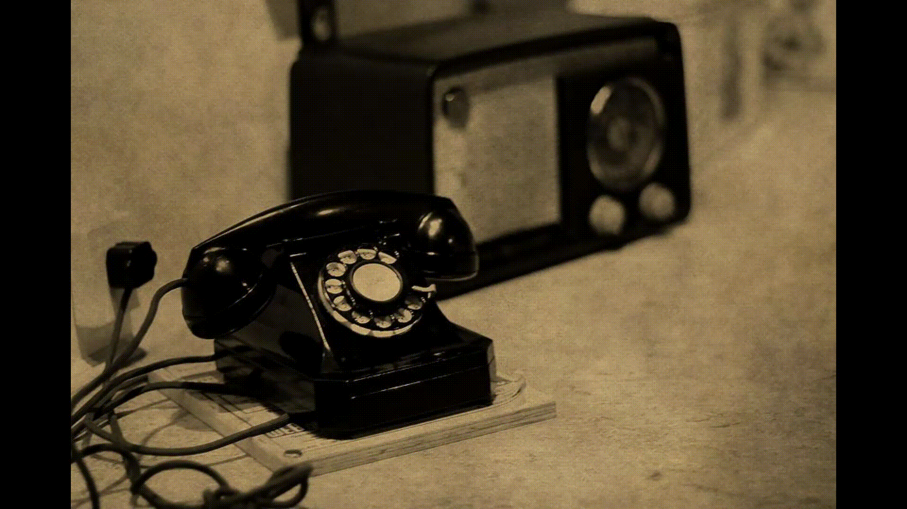

### IoT?
In essence, the Internet of Things means that “dumb” devices (e.g., a lightbulb) become “smart” when the lightbulb can be remotely controlled and/or able to exchange data with production, operator or other connected devices. 

The Internet of Things is a hot word in technology industry right now, it promises to change the way we live our lives, and as the word travels from mouth to mouth, IoT devices get more and more adopted. The number of devices is expected to reach 50 billion by the end of 2020 and reach 1 trillion by the end of year 2035.

# Project Proposal
The aim of our project is to create a web application to act as a marketplace just for IoT Devices. Our application will provide the tools necessary for any IoT manufacturer to sell their products, and help the customer discover the full spectrum of IoT Devices. We want to filter the IoT products from the massive pool of usual/dumb products.

Application will be accessible worldwide, will facilitate 3rd party shipments, selling/buying functionality, and help customers discover new products.

We will have a working prototype ready to showcase on 20th November and final product will be launched on 13th December

## Team "Chuck Norris" (Team-6)

  -- [x]### Members
  - [x] Lucian Nechita
  - [x] Marius Pal
  - [x] Carlos Barbier
  - [x] Daniel Costel Neagu

